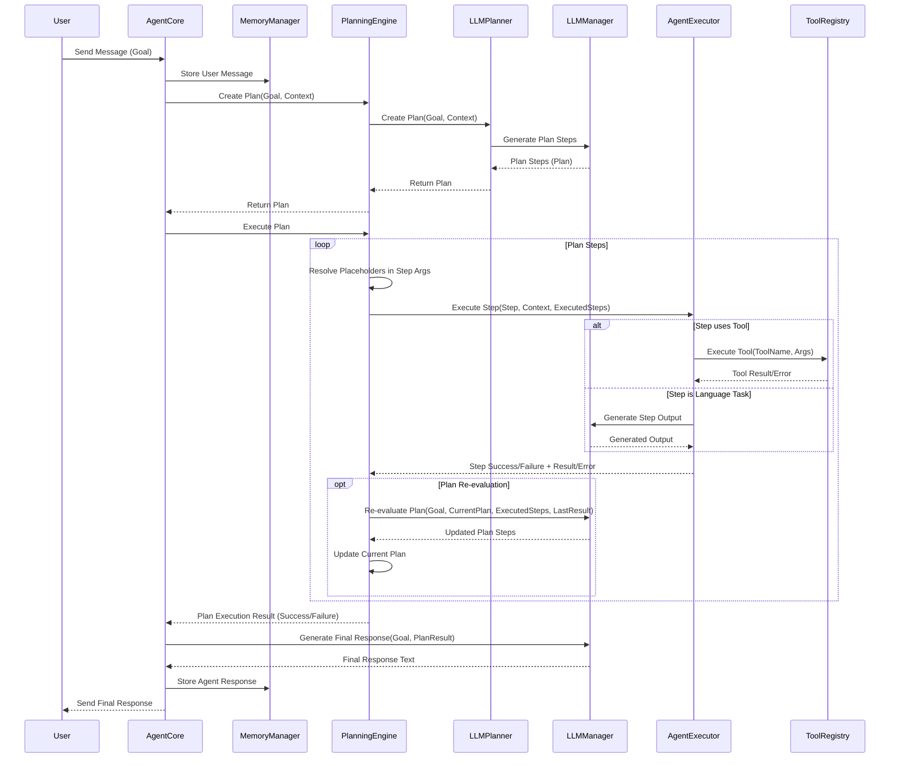

# Catalyst Agent Documentation

## Introduction

The `catalyst_agent` is an AI system designed to understand user goals, create execution plans, and utilize available tools and language models (LLMs) to achieve those goals. It coordinates memory, planning, and tool execution to handle complex tasks. Key components include:

*   **AgentCore:** The central orchestrator.
*   **LLMManager:** Manages interactions with the configured Large Language Model (e.g., for planning, generating responses, fixing code).
*   **ToolRegistry:** Manages available tools (e.g., file I/O, web search, code execution) and their execution.
*   **PlanningEngine:** Coordinates the creation (`Planner`) and execution (`Executor`) of plans.
*   **MemoryManager:** Handles short-term conversation history and optional long-term memory persistence.

## Core Components & Interaction Flow

When a user sends a message, the agent processes it through the following steps:

1.  **Message Reception:** `AgentCore` receives the message.
2.  **Memory Update:** The message is added to the `MemoryManager`.
3.  **Context Assembly:** `AgentCore` gathers context, including conversation history (from `MemoryManager`), available tools (from `ToolRegistry`), and configuration.
4.  **Planning (if enabled):**
    *   `AgentCore` calls `PlanningEngine.create_plan` with the user's goal and context.
    *   `PlanningEngine` uses its configured `Planner` (e.g., `LLMPlanner`).
    *   `LLMPlanner` interacts with the `LLMManager` to generate a sequence of steps (`PlanStep` objects) forming a `Plan`.
5.  **Execution:**
    *   `AgentCore` calls `PlanningEngine.execute_plan`.
    *   `PlanningEngine` iterates through the plan's steps using `execute_next_step`.
    *   For each step:
        *   **Placeholder Resolution:** `PlanningEngine` resolves any placeholders (like `{step_1_result}`) in the step's arguments using results from previously executed steps.
        *   **Step Execution:** `PlanningEngine` calls its configured `Executor` (e.g., `AgentExecutor`).
        *   `AgentExecutor` determines if the step requires a tool or is a language task:
            *   **Tool Task:** It calls `ToolRegistry.execute_tool` with the resolved arguments. The `ToolRegistry` finds and runs the appropriate `Tool`. Error handling and recovery might occur here.
            *   **Language Task:** It uses the `LLMManager` to generate the required output based on the step description and context.
        *   The result or error is stored in the `PlanStep`.
        *   The executed step (as a dictionary) is added to the `executed_steps` list in `PlanningEngine`.
    *   **Plan Re-evaluation (Optional):** After a step successfully executes, the `PlanningEngine` can call the `LLMManager` to re-evaluate the remaining plan based on the new result, potentially modifying, adding, or removing future steps.
6.  **Response Generation:**
    *   Once the plan is complete (or fails), `AgentCore` generates a final response for the user.
    *   It uses the `LLMManager`, providing the original goal, the final plan status, results/errors from steps, and potentially reasoning captured during planning.
7.  **Memory Update:** The agent's response is added to the `MemoryManager`.
8.  **Send Response:** The final response is sent back to the user.

## The Planning Process

Planning is central to the agent's ability to tackle multi-step tasks.

1.  **Initiation:** When `AgentCore` receives a message and planning is enabled, it calls `PlanningEngine.create_plan`.
2.  **Plan Generation:** The `PlanningEngine` delegates plan creation to a `Planner`. The `LLMPlanner` implementation uses the `LLMManager` to interact with an LLM. It sends the user's goal, conversation history, available tool descriptions, and other context to the LLM, prompting it to generate a structured plan.
3.  **Plan Structure:** The generated plan is represented by a `Plan` object (`planning/base.py`), which contains the original `goal` and a list of `PlanStep` objects. Each `PlanStep` has:
    *   `id`: A unique identifier.
    *   `description`: What the step aims to achieve.
    *   `tool_name`: The tool to use (optional).
    *   `tool_args`: Arguments for the tool (optional).
    *   `depends_on`: A list of IDs of steps that must complete first (optional).
    *   `status`: Current state (`PENDING`, `IN_PROGRESS`, `COMPLETED`, `FAILED`).
    *   `result`/`error`: Stores the outcome after execution.
4.  **Execution:** The `PlanningEngine` executes the plan using `execute_next_step`, which finds the next `PENDING` step whose dependencies are `COMPLETED`. It passes the step to an `Executor`.
5.  **Executor Role:** The `AgentExecutor` handles the actual execution, either by invoking a tool via the `ToolRegistry` or by using the `LLMManager` for language-based tasks (like summarizing or answering directly).
6.  **Re-evaluation:** After a step completes successfully, the `PlanningEngine` can optionally use the `LLMManager`'s `reevaluate_plan` function. This allows the LLM to look at the result of the completed step and adjust the *remaining* steps in the plan if necessary, providing adaptability.

## Placeholder Resolution

To enable dynamic data flow between steps, the `PlanningEngine` supports placeholder resolution within tool arguments.

*   **Purpose:** Allows a step to use the output (`result`) of a previously completed step as input for its own tool arguments.
*   **Syntax:** Placeholders are defined using the format `{step_N_result}`, where `N` is the 1-based index of the step whose result is needed (e.g., `{step_1_result}`, `{step_3_result}`).
*   **Mechanism:** Before executing a step via the `AgentExecutor`, the `PlanningEngine.execute_next_step` method calls the internal `_resolve_placeholders` function.
*   **Resolution:** This function recursively traverses the `tool_args` dictionary (and any nested lists or dictionaries within it).
    *   If a string value exactly matches the placeholder pattern (e.g., `"arg1": "{step_2_result}"`), it's replaced entirely with the actual result data from step 2.
    *   If a string value *contains* one or more placeholders (e.g., `"filename": "output_from_{step_1_result}.txt"`), the placeholders are replaced with their corresponding results (converted to strings).
    *   The resolution happens *just before* the step is passed to the `AgentExecutor`, ensuring the most up-to-date results are used.